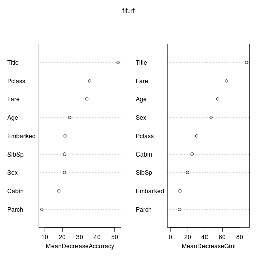

Titanic Survival Prediction
========================================================
## Introduction
Titanic [1] is a kaggle competition for tutorial purpose.  The goal is to predict whether the passengers survived or not in the sinking of the Titanic.  The data includes passenger information such as sex, age, name, ticket fare, class, number of siblings and parents/children aboard, etc.  The evaluation criteria is the prediction accuracy (rate of correct prediction) of the passengers in a test set.  The test set is splinted into two parts, 50% for public score and 50% for private score. For each submission, the public score is feed-backed immediately, while the private score is kept secret.  After submission deadline, the final ranking is based on the private score.
## R packages 

```r
library(dplyr)
```

```
## 
## Attaching package: 'dplyr'
## 
## The following objects are masked from 'package:stats':
## 
##     filter, lag
## 
## The following objects are masked from 'package:base':
## 
##     intersect, setdiff, setequal, union
```

```r
library(stringr)
library(randomForest)
```

```
## randomForest 4.6-10
## Type rfNews() to see new features/changes/bug fixes.
```

```r
library(glmnet)
```

```
## Loading required package: Matrix
## Loaded glmnet 1.9-8
```
## Data input

```r
df <- read.csv('train.csv',stringsAsFactors=FALSE)
df.test <- read.csv('test.csv',stringsAsFactors=FALSE)
```
We check the summary of data, and the ratio of missing values.

```r
str(df)
```

```
## 'data.frame':	891 obs. of  12 variables:
##  $ PassengerId: int  1 2 3 4 5 6 7 8 9 10 ...
##  $ Survived   : int  0 1 1 1 0 0 0 0 1 1 ...
##  $ Pclass     : int  3 1 3 1 3 3 1 3 3 2 ...
##  $ Name       : chr  "Braund, Mr. Owen Harris" "Cumings, Mrs. John Bradley (Florence Briggs Thayer)" "Heikkinen, Miss. Laina" "Futrelle, Mrs. Jacques Heath (Lily May Peel)" ...
##  $ Sex        : chr  "male" "female" "female" "female" ...
##  $ Age        : num  22 38 26 35 35 NA 54 2 27 14 ...
##  $ SibSp      : int  1 1 0 1 0 0 0 3 0 1 ...
##  $ Parch      : int  0 0 0 0 0 0 0 1 2 0 ...
##  $ Ticket     : chr  "A/5 21171" "PC 17599" "STON/O2. 3101282" "113803" ...
##  $ Fare       : num  7.25 71.28 7.92 53.1 8.05 ...
##  $ Cabin      : chr  "" "C85" "" "C123" ...
##  $ Embarked   : chr  "S" "C" "S" "S" ...
```

```r
summary(df)
```

```
##   PassengerId     Survived         Pclass         Name          
##  Min.   :  1   Min.   :0.000   Min.   :1.00   Length:891        
##  1st Qu.:224   1st Qu.:0.000   1st Qu.:2.00   Class :character  
##  Median :446   Median :0.000   Median :3.00   Mode  :character  
##  Mean   :446   Mean   :0.384   Mean   :2.31                     
##  3rd Qu.:668   3rd Qu.:1.000   3rd Qu.:3.00                     
##  Max.   :891   Max.   :1.000   Max.   :3.00                     
##                                                                 
##      Sex                 Age            SibSp           Parch      
##  Length:891         Min.   : 0.42   Min.   :0.000   Min.   :0.000  
##  Class :character   1st Qu.:20.12   1st Qu.:0.000   1st Qu.:0.000  
##  Mode  :character   Median :28.00   Median :0.000   Median :0.000  
##                     Mean   :29.70   Mean   :0.523   Mean   :0.382  
##                     3rd Qu.:38.00   3rd Qu.:1.000   3rd Qu.:0.000  
##                     Max.   :80.00   Max.   :8.000   Max.   :6.000  
##                     NA's   :177                                    
##     Ticket               Fare          Cabin             Embarked        
##  Length:891         Min.   :  0.0   Length:891         Length:891        
##  Class :character   1st Qu.:  7.9   Class :character   Class :character  
##  Mode  :character   Median : 14.5   Mode  :character   Mode  :character  
##                     Mean   : 32.2                                        
##                     3rd Qu.: 31.0                                        
##                     Max.   :512.3                                        
## 
```

```r
options(digits=3)

rbind(na = colMeans(is.na(df)), nullstr = colMeans(df == ""))
```

```
##         PassengerId Survived Pclass Name Sex   Age SibSp Parch Ticket Fare
## na                0        0      0    0   0 0.199     0     0      0    0
## nullstr           0        0      0    0   0    NA     0     0      0    0
##         Cabin Embarked
## na      0.000  0.00000
## nullstr 0.771  0.00224
```

```r
rbind(na = colMeans(is.na(df.test)), nullstr = colMeans(df.test == ""))
```

```
##         PassengerId Pclass Name Sex   Age SibSp Parch Ticket    Fare Cabin
## na                0      0    0   0 0.206     0     0      0 0.00239 0.000
## nullstr           0      0    0   0    NA     0     0      0      NA 0.782
##         Embarked
## na             0
## nullstr        0
```

## Pre-processing
### Feature extraction
A few features are created or modified.  For cabin, we get the first capital letter.  For title, we extract the middle pattern of the name field.  

```r
# extract Cabin/Embarked/Title
extractFeatures <- function(df) {
  df %.% 
    mutate(Cabin = str_extract(Cabin,'^[A-Z]')) %.%
    mutate(Embarked = str_extract(Embarked,'^[CQS]')) %.%
    mutate(Title = str_extract(str_extract(Name, ', \\w+\\.'), 
                               '\\w+'))    
}
```
A few features will not be used in prediction and thus removed.

```r
removeFeatures <- function(df) {
  df %.% select(-Ticket, -Name, -PassengerId)
}
```
### Imputing missing values
For numeric features, the missing values are replaced by the mean of non-missing values.  For categorical features, the missing values are replaced by a fixed string "Unknown".

```r
calculateImputeValues <- function(df) {
  lapply(df, function(col) 
    ifelse(is.numeric(col), mean(col, na.rm=T), "Unknown"))
}
imputeFeatures <- function(df, impute.values) {
  for (c in names(df)) {
      df[[c]] <- ifelse(is.na(df[[c]]), impute.values[[c]], df[[c]])
  }
  df
}
```
### Features as factors
Character features need to change to factor type.   Note that we need to have the same factor levels for the train data and test data for the prediction function to work properly.  Thus we use the factor levels of the training set as reference.  New levels in the test set will become NAs and then assigned a fixed level "Unknown".

```r
chr.features.to.factor <- function(df, use.ref=F, df.ref=NA) {
  for (c in names(df)) {
    if (is.character(df[[c]])) {
      if (!use.ref) {
        df[[c]] <- factor(df[[c]])
      }  
      else {
        df[[c]] <- factor(df[[c]], levels=levels(df.ref[[c]]))
      }  
      df[[c]][is.na(df[[c]])] <- "Unknown"
    }
  }
  df  
}
  
df2 <- extractFeatures(df)
df2 <- removeFeatures(df2)
impute.train <- calculateImputeValues(df2)
df2 <- imputeFeatures(df2, impute.train)
df2 <- chr.features.to.factor(df2)
```

```
## Warning: invalid factor level, NA generated
```

```r
df2 <- df2 %.% mutate(Survived = factor(Survived))
```
Similar processing are applied to test set.  Note that the imputing value is from the training set, not the test set itself.

```r
df.test2 <- extractFeatures(df.test)
df.test2 <- removeFeatures(df.test2)

df.test2 <- imputeFeatures(df.test2, impute.train)
df.test2 <- chr.features.to.factor(df.test2, use.ref=T, df2)
```

```
## Warning: invalid factor level, NA generated
```
## Random forest model
First we use random forest as the classifier and use all remaining (non-removed) features for model training.

```r
seed = 123
set.seed(seed)
fit.rf <- randomForest(Survived ~  ., data = df2, importance=T)
fit.rf
```

```
## 
## Call:
##  randomForest(formula = Survived ~ ., data = df2, importance = T) 
##                Type of random forest: classification
##                      Number of trees: 500
## No. of variables tried at each split: 3
## 
##         OOB estimate of  error rate: 17.2%
## Confusion matrix:
##     0   1 class.error
## 0 490  59       0.107
## 1  94 248       0.275
```

```r
pred <- predict(fit.rf,newdata=df.test2)
df.out <- data.frame(PassengerId = df.test$PassengerId, 
                     Survived = pred)
write.csv(df.out, file="randomForest_1.csv", 
          row.names=F, quote=F)

varImpPlot(fit.rf)
```

 
The kaggle public score is 0.76555.  We could see the variable importance in the plot.
### Using fewer features
We try to use fewer features by only selecting the important ones.  From the kaggle public leaderboard, there is one benchmark called "Gender, Price and Class Based Model".  Thus we try to use only these  features in prediction. The resulting public score is 0.78469.

```r
set.seed(seed)

fit.rf <- randomForest(Survived ~ Pclass + Sex + Fare  , data = df2)
fit.rf
```

```
## 
## Call:
##  randomForest(formula = Survived ~ Pclass + Sex + Fare, data = df2) 
##                Type of random forest: classification
##                      Number of trees: 500
## No. of variables tried at each split: 1
## 
##         OOB estimate of  error rate: 19.9%
## Confusion matrix:
##     0   1 class.error
## 0 495  54      0.0984
## 1 123 219      0.3596
```

```r
pred <- predict(fit.rf,newdata=df.test2)
df.out <- data.frame(PassengerId = df.test$PassengerId, 
                     Survived = pred)
write.csv(df.out, file="randomForest_PclassSexFare.csv", 
          row.names=F, quote=F)
```
We could also select features based on the variable importance provided by random forest.  Based on 'MeanDecreaseGini', four features form a leading group: Title, Fare, Age, Sex.  Training a model with these features, we get a kaggle public score 0.75120.

```r
set.seed(seed)

fit.rf <- randomForest(Survived ~ Title + Fare + Age + Sex, data = df2)
fit.rf
```

```
## 
## Call:
##  randomForest(formula = Survived ~ Title + Fare + Age + Sex, data = df2) 
##                Type of random forest: classification
##                      Number of trees: 500
## No. of variables tried at each split: 2
## 
##         OOB estimate of  error rate: 18.7%
## Confusion matrix:
##     0   1 class.error
## 0 471  78       0.142
## 1  89 253       0.260
```

```r
pred <- predict(fit.rf,newdata=df.test2)
df.out <- data.frame(PassengerId = df.test$PassengerId, 
                     Survived = pred)
write.csv(df.out, file="randomForest_TitleFareAgeSex.csv", 
          row.names=F, quote=F)
```
Based on 'MeanDecreaseAccuracy', three features form a leading group: Title, Pclass, Fare.  Training a model with these features, we get a kaggle public score 0.79904.

```r
set.seed(seed)

fit.rf <- randomForest(Survived ~ Title + Pclass + Fare, data = df2)
fit.rf
```

```
## 
## Call:
##  randomForest(formula = Survived ~ Title + Pclass + Fare, data = df2) 
##                Type of random forest: classification
##                      Number of trees: 500
## No. of variables tried at each split: 1
## 
##         OOB estimate of  error rate: 19.1%
## Confusion matrix:
##     0   1 class.error
## 0 503  46      0.0838
## 1 124 218      0.3626
```

```r
pred <- predict(fit.rf,newdata=df.test2)
df.out <- data.frame(PassengerId = df.test$PassengerId, 
                     Survived = pred)
write.csv(df.out, file="randomForest_TitlePclassFare.csv", 
          row.names=F, quote=F)
```
          
## Logistic regression model
Here we try to use a simpler model, logistic regression.  All non-removed features are put into model training, as the glmnet package provides some capability for automatic feature selection.  The kaggle public score is 0.77033.

```r
set.seed(seed)
fit.glm <- cv.glmnet(data.matrix(df2 %.% select(-Survived)), df2$Survived,  alpha=1, family="binomial")

coef(fit.glm)
```

```
## 10 x 1 sparse Matrix of class "dgCMatrix"
##                    1
## (Intercept)  4.90511
## Pclass      -0.60272
## Sex         -2.09236
## Age         -0.00787
## SibSp       -0.01203
## Parch        .      
## Fare         .      
## Cabin       -0.04089
## Embarked    -0.03499
## Title        .
```

```r
pred <- predict(fit.glm, newx=data.matrix(df.test2), s = "lambda.min", type="class")
df.out <- data.frame(PassengerId = df.test$PassengerId, 
                     Survived = as.vector(pred))
write.csv(df.out, file="glmnet_1.csv", 
          row.names=F, quote=F)
```
# Reference
1. https://www.kaggle.com/c/titanic-gettingStarted
